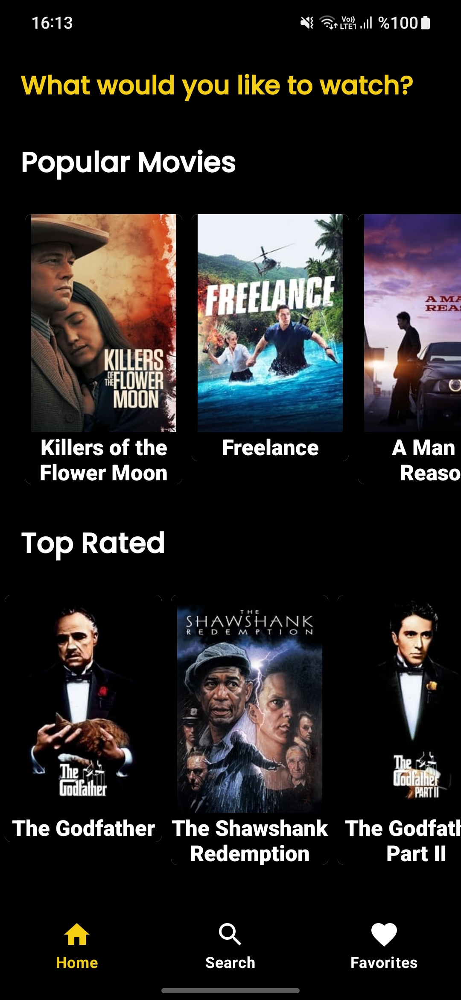
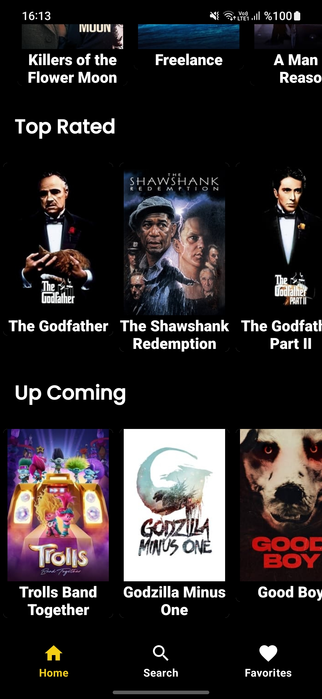
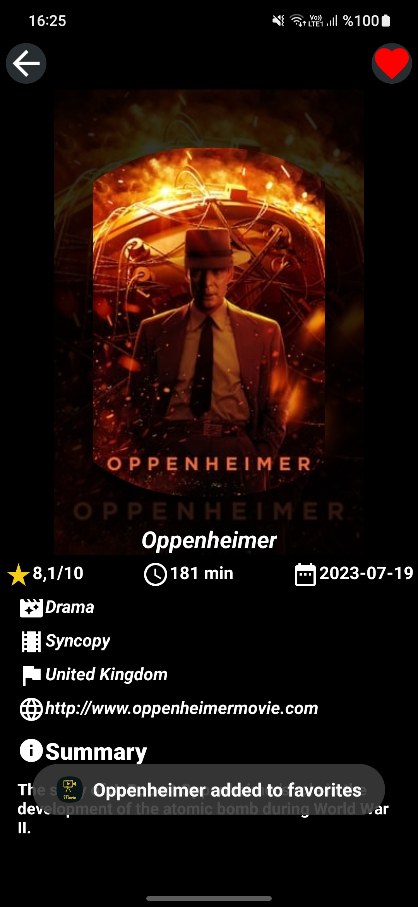
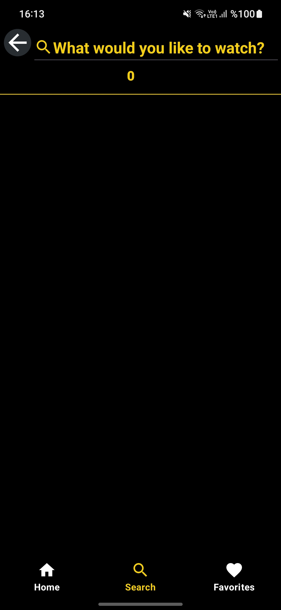
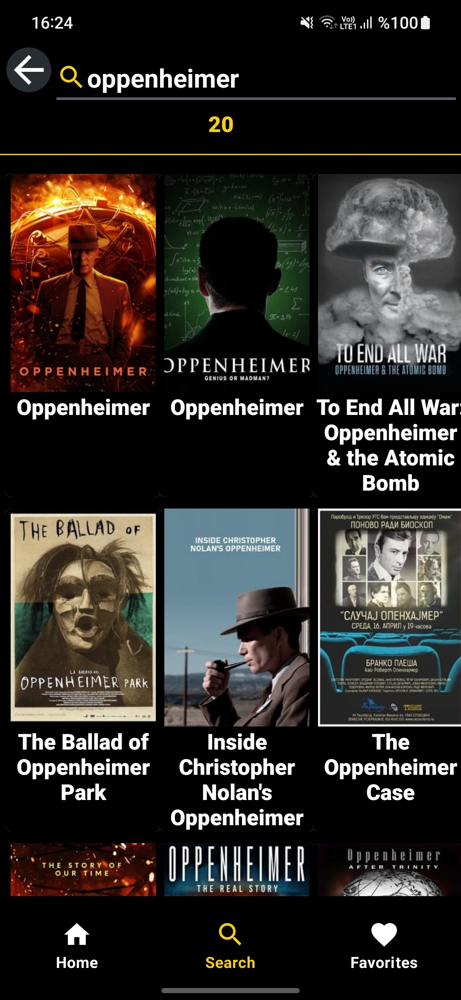
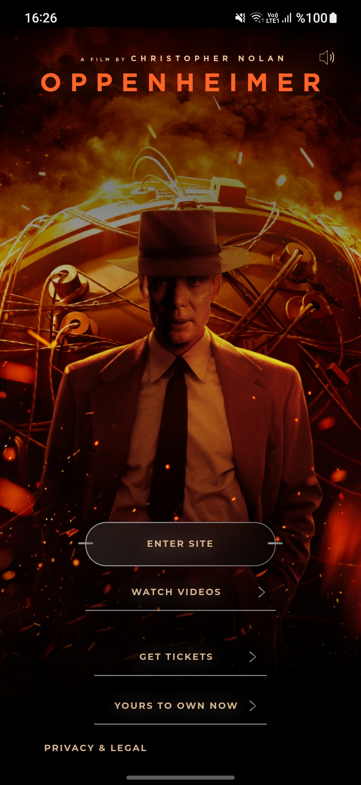
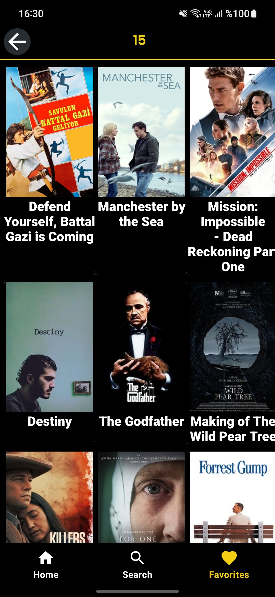
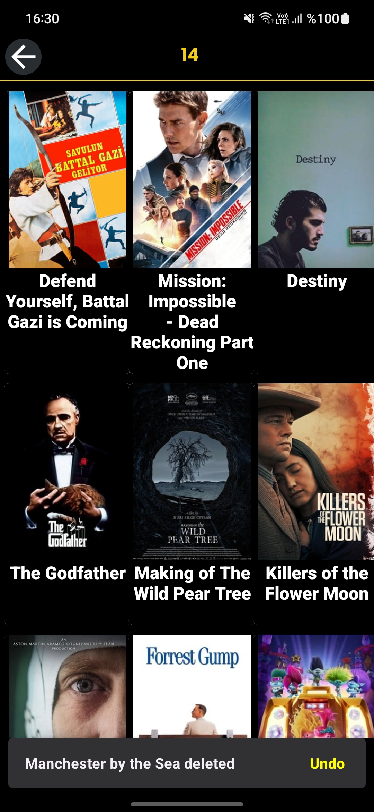

# MVVVMMovieApp
 Bu proje, MVVM (Model-View-ViewModel) mimarisi kullanılarak geliştirilmiş bir film uygulamasını içermektedir.

##Genel Bakış

Bu proje, API kullanarak film verilerini alıp gösteren bir Android uygulamasını içermektedir. Aşağıda, projeyi anlamak ve çalıştırmak için gerekli bilgiler bulunmaktadır.

##Özellikler

Home Fragment içinde popüler filmler, yüksek puanlı filmler ve api desteği aldığımız siteye yüklenecek olan filmler recyclerviewlar içinde gösterilmiştir.
Bu recyclerviewlar içinde gösterilen bir filme tıklanarak MovieDetailsActivity'e geçiş yapılabilir ve burada filme ait bilgiler ( poster,isim,puan,süre,çıkış tarihi,türü,yapım şirketi ve yapım şirketinin ülkesi, filme ait bir link ve özet) yer almaktadır.
Burada filme ait api'nin bize sağladığı  sağladığı linke tıklayarak,filme ait bilgilere (bu bilgiler filmden filme değişiyor bazısında tanıtım videoları,bazılarında filmin yapım  şirketinin filme dair linki vb bilgiler sağlanmakta.Burada amaç zaten başarılı bir şekilde web view örneği yapmaktı.) web view üzerinden ulaşabiliriz.

MovieDetailsActivity'de açtığımız filmi sağ üstte bulunan favori butonu ile room database'imize kaydedebiliriz.

Search Fragment'de ise isime göre api üzerinde kayıtlı olan filmleri aratabiliriz.Burada arattığımız kelimeye göre bütün sonuçları recyclerview içinde gösterilir 
ve elde edilen sonuçların sayısı da üstte belirtilir.Burada da arattığımız sonuçlardan istenilen filme tıklanarak MovieDetailsActivity'e geçiş yapılabilir.

Favorites Fragment'da ise favorilere eklediğimiz filmler recyclerview içinde gösterilmekte.Burada gösterilen film sola kaydırılarak room database'den silme işlemi gerçekleştirebilir.
Film silindikten snackbar gösterilir ve içinde filmin isim bilgisi ile beraber silindi yazsısı gösterilir.Snackbar içine yerleştirilen "undo" ya basılarak film tekrardan room database ve recyclerview'a eklenebilir.

##Kullanılan Teknolojiler

Kotlin
Android Architecture Components (ViewModel, LiveData)
ViewBinding
NavigationComponent
Retrofit
Glide
Database(room)
Coroutines
RecyclerView
WebView

## Ekran Görüntüleri

##Ek Bilgiler

Bu uygulama The Movie Database (TMDb) API kullanılarak geliştirilmiştir.

##Kurulum

Proje dosyalarını bilgisayarınıza klonlayın veya ZIP olarak indirin.

https://github.com/hariellevardamir/MVVVMMovieApp.git

Android Studio'da projeyi açın.

API anahtarınızı Constants.kt dosyasında güncelleyin.

Projeyi çalıştırın.
